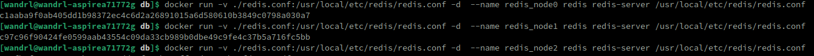
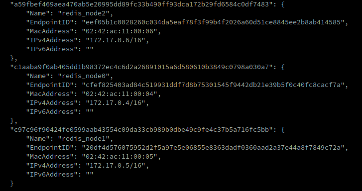
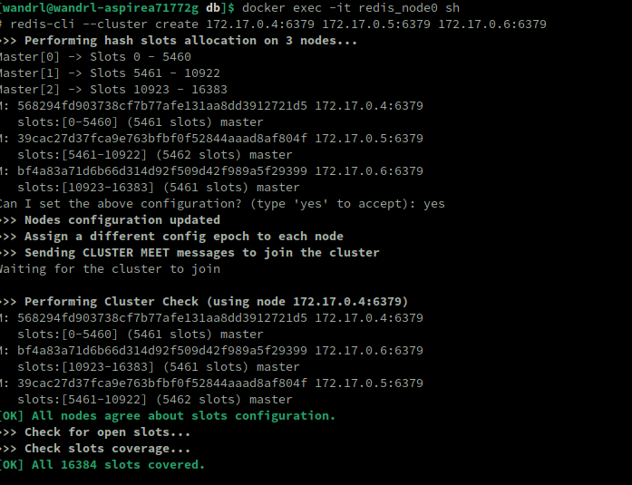
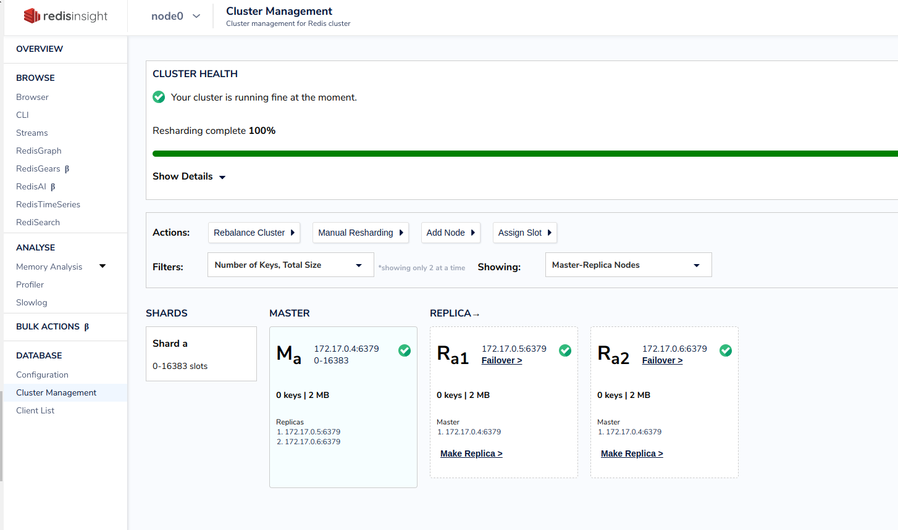
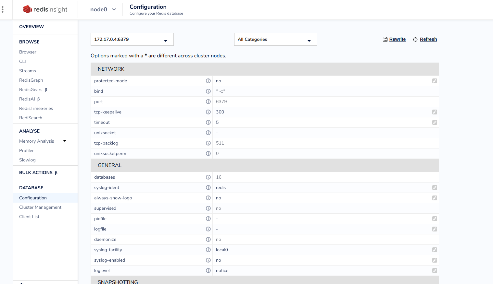

# Задание 3 - Redis
Первые пункты задания выполнены в jupyter ноутбуке, см файл.
## Разворачивание кластера
1. Запустим несколько контейнеров с redis, в каждый передадим конфиг в котором включим cluster-mode.

2. Cмотрим на их ip.

3. Запускаем кластер на трех нодах

4. На redisinsight делаем 2 из 3 ноды репликами одной единственной.

5. После чего, можно продолжать настраивать что угодно и как угодно (timeout выставил в 5 секунд).

